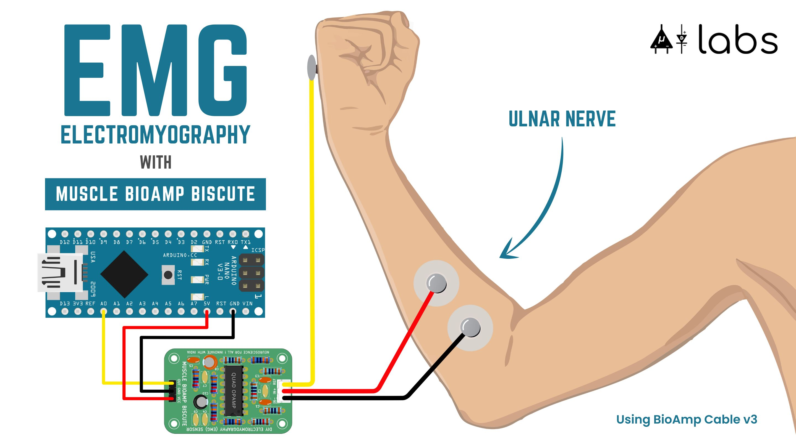
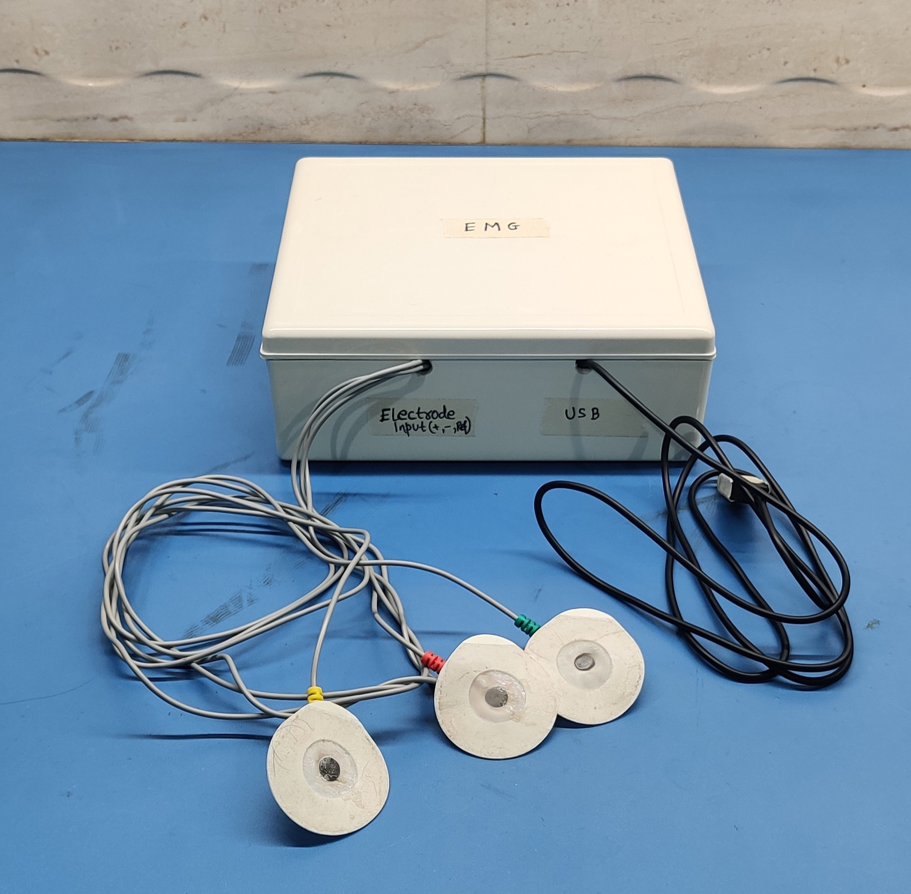
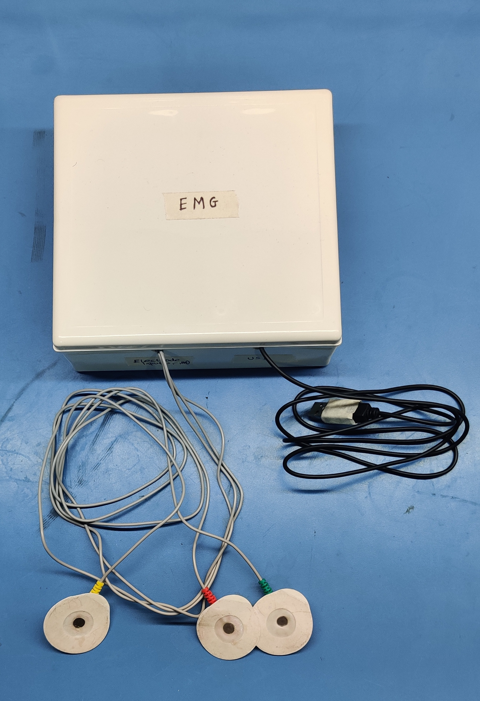
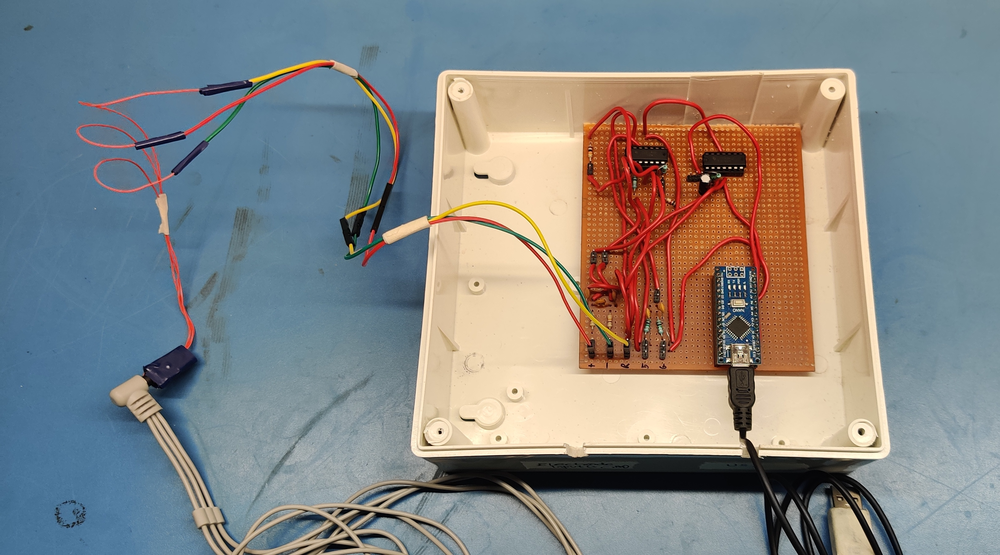

# ElectroMyoGraphy (EMG)

[Electromyography (EMG)](https://en.wikipedia.org/wiki/Electromyography) is a technique for evaluating and recording the electrical activity produced by skeletal muscles. This device is used to detect electric potential generated by muscle cells when these cells are electrically or neurologically activated. The circuit used in this project provides a fixed gain of x2420 along with a bandpass filter of 72 Hz to 720 Hz. To record the analog signals, the ADC of an Arduino Nano was used.

> Ensure that your laptop is NOT connected to your AC Wall Charger or to an external monitor. The 50-60 Hz wall outlet frequency interferes with the measured signals.

## Block Diagram

The differential voltage input from **Electrode A** and **Electode B** is taken with reference to the **Yellow Reference Electrode**. This is then passed onto the instrumentation amplifer to ampify the signal by 11 times. The output of the instrumentation amplifier is passed into a bandpass filter with an amplification of 220. The output of the bandpass filter is our final analog output. This analog output is then fed into the ADC pin of Arduino Nano.

## Electrode Placement

## Circuit Design
The hardware design was borrowed from [Upside Down Labs Muscle-BioApm-BisCute](https://github.com/upsidedownlabs/Muscle-BioAmp-BisCute) which is an incredibly simple circuit to get started with EMG. They have an amazing documentation and readily available boards on [Amazon](https://www.amazon.in/BisCute-Accessories-Upside-Down-Labs/dp/B0BDRFL2VY/ref=sr_1_1?qid=1684148917&refinements=p_89%3AUpside+Down+Labs&s=industrial&sr=1-1), [Tindie](https://www.tindie.com/products/upsidedownlabs/muscle-bioamp-biscute-diy-muscle-sensor/) and their [self hosted webstore](https://store.upsidedownlabs.tech/product/muscle-bioamp-biscute-diy/). Here is the schematic that was used for the design:

The only difference between both the designs is that I used TL074 instead of LM324 as Operational Amplifiers in the circuit.

## Actual Hardware
Three electrodes have to be connected to the box and the USB cable goes to a laptop (running on battery, very important)!

Hardware inside the box

## Software
The Muscle-BioAmp-BisCute circuit provides a decent Arduino sketch that does everything for you. All you have to do is open the sketch and flash it. You can also find a copy of the firmware in the `Software/` folder.

## Demo

